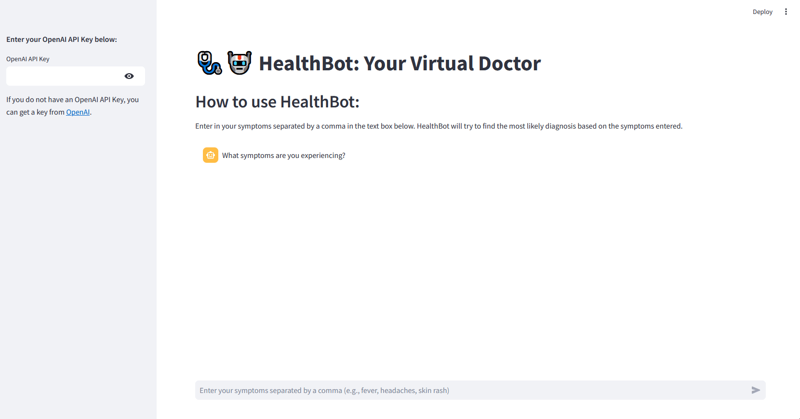

# 🩺🤖 HealthBot: Your Virtual Doctor

### DISCLAIMER:  
***THIS APPLICATION IS NOT TO BE CONSTITUTED AS PROFESSIONAL MEDICAL ADVICE***  

This application is a personal project to showcase technical skills with generative AI (Gen AI) and the ability to leverage a large language model (LLM) for a custom purpose. The developer is not responsible for any health outcomes.

**Contents:**
- [Purpose](#Purpose)
- [HealthBot App](#HealthBot-App)
- [How to Run HealthBot App](#How-to-Run-HealthBot-App)
- [Requirements](#Requirements)
  - [OpenAI API Key](#OpenAI-API-Key)
  - [Python Modules](#Python-Modules)
- [Fine-Tuning](#Fine-Tuning)
  - [Fine-Tuning Stats](#Fine-Tuning-Stats)
- [Limitations](#Limitations)
- [Future Directions to Improve HealthBot Accuracy and UX](#Future-Directions-to-Improve-HealthBot-Accuracy-and-UX)

#### Purpose

An application to leverage OpenAI's GPT-4 LLM to suggest a medical diagnosis based on symptoms entered by a user

This project is as an elementary proof of concept for an application that uses Gen AI to address the problem of obtaining medical advice in underserved areas.

#### HealthBot App


#### How to Run HealthBot App

The HealthBot is deployed using [Streamlit](https://streamlit.io/). To run the app, make the working directory the folder where the `healthbot_streamlit_app.py` file is located and type in the command prompt (Windows) or Terminal (Mac, Linux, IDE):
```bash
streamlit run healthbot_streamlit_app.py
```
The app will run in a browser. You will need a valid OpenAI API key to use the application.


#### Requirements
##### OpenAI API Key
An OpenAI API key is required to train and use the HealthBot application. You can obtain a key from [OpenAI](https://platform.openai.com/account/api-keys).

Once you have an OpenAI API key, create a `.env` file in any text editor to follow best practice and store the key as a string environment variable by entering the following line:

`OPENAI_API_KEY="Your OpenAI API Key"`

If you are pushing to public or shared repositories, add the `.env` file to `.gitignore` to avoid exposing your personal key.

##### Python Modules
- openai
- streamlit >= 1.31.0

#### Fine-Tuning

The disease and symptoms dataset used for fine-tuning can be found [here](https://www.kaggle.com/datasets/choongqianzheng/disease-and-symptoms-dataset/data?select=DiseaseAndSymptoms.csv).

Data used for OpenAI LLM fine-tuning was preprocessed to remove unwanted characters, make text lowercase, and concatenate symptoms into one string. The required format for training data is `.jsonl`. See the fine-tuning training data [here](./fine_tuning_data/chat_data_for_fine_tuning.jsonl).

**NOTE:** To limit the training cost, the `gpt-4o-mini` LLM was used for fine-tuning.

##### Fine-Tuning Stats
- Trained tokens: **693,960**
- Epochs: **2**
- Batch size: **6**
- Cost: **$2.08 CAD**
- Time required: **00:30:59**

#### Limitations
- Small quantity of training data used for GPT-4 mini LLM fine-tuning
- Potential response fabrication (which is an issue that is prevalent in chatbots)

#### Future Directions to Improve HealthBot Accuracy and UX
- Use more training data during LLM fine-tuning
- Enhance data quality via verification by medical professionals
- Add medical recourse based on diagnosis as part of HealthBot response
- Leverage newer, state of the art LLM
- More specific context for chatbot persona to improve prompt engineering
- Rigorous hyperparameter tuning (e.g., increase the number of epochs for fine-tuning, adjust temperature for response generation)
